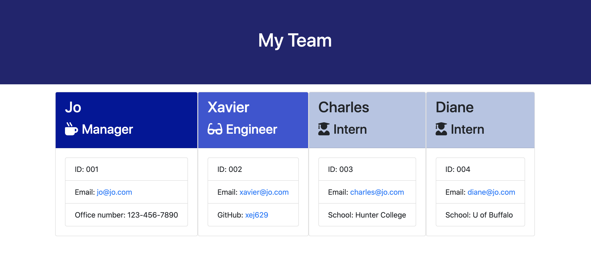

# Team Member Webage Generator
  
  
  
  ## Table of Contents
  1. [Project Description](#description)
  2. [Installation](#install)
  3. [Usage](#usage)
  4. [License](#license)
  5. [Contributors](#contributors)
  6. [Tests](#tests)
  7. [Questions](#questions)
  

  
  ## Project Description
  If you're looking for a way to create an HTML page of your employees/team members using nothing but your command line, look no further!  Here is a Team Member Webpage Generator that will handle all the hard work for you.  Simply answer the questions in the integrated terminal and the webpage will generate once you're done.
  
  ## Installation
  Execute the command "npm install" and you're all set.
  
  ## Usage
  After installing your packages, type in "node index" in the integrated terminal.  Question prompts will appear for you to answer.  Answer the questions and follow through to the end for as many employees as you need.
  
  ### License
  MIT
  
  ### Contributors
  Jonayah M. Jackson
  
  #### Tests
  All in all, there were 18 tests to check the functionality of this generator:
  
  * Employee Tests
    1. Can instantiate Employee instance
    2. Can set name via constructor arguments
    3. Can set id via constructor argument
    4. Can set email via constructor argument
    5. Can get name via getName
    6. Can get id via getId
    7. Can get email via getEmail
    8. getRole() should return "Employee"
    9. Can set GitHUb account via constructor
 
  * Engineer Tests
    1. Can set GitHUb account via constructor
    2. getRole() should return "Engineer"
    3. Can get GitHub username via getGithub
 
  * Intern Tests      
    1. Can set school via constructor
    2. getRole() should return "Intern"
    3. Can get school via getSchool
 
  * Manager Tests      
    1. Can set office number via constructor argument
    2. getRole() should return "Manager"
    3. Can get office number via getOffice
  
  #### Questions (FAQs)
  * Q: Do I need to install anything? A: Yes, install Inquirer.
  * Q: Once I answer the questions, what do I need to do? A: Nothing, the webpage will autopopulate Bootstrap cards of your team members and their respective information. 
  * Q: I keep seeing a wild comma on my page.  What do I do?  A: Look for random commas in the generated html code in between divs and delete them.

  ###### Contact Me
  * GitHub Profile: https://github.com/JonayahJ
  * Email Address: jonayah@thinkhalcyon.com